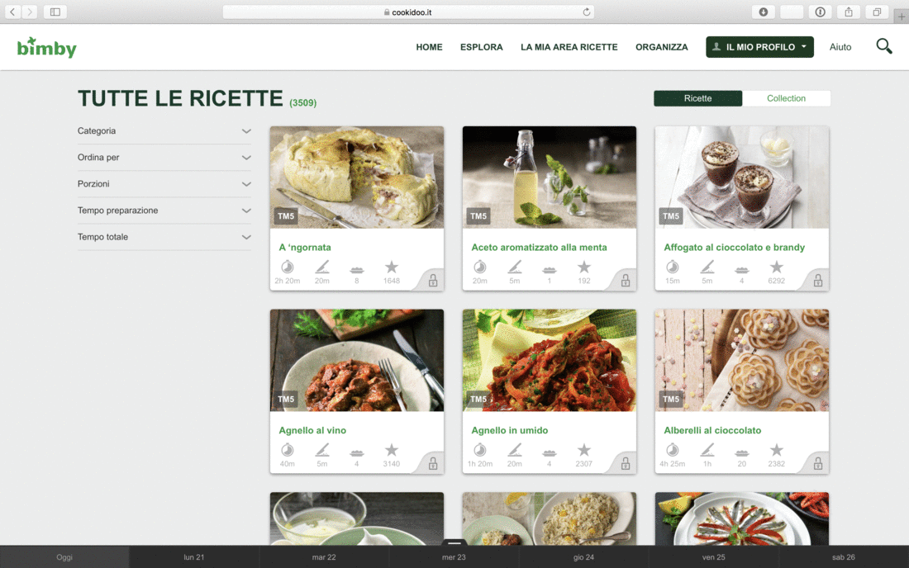

# cookidump

Easily dump cookidoo recipes from the official website

### Description ###

This program allows you to dump all recipes on [Cookidoo](https://cookidoo.co.uk) websites (available for different countries) for offline and posticipate reading.
Those recipes are valid in particular for [Thermomix/Bimby](https://en.wikipedia.org/wiki/Thermomix) devices.
In order to dump the recipes, a valid subscription is needed.

The main program is based on [jakubszalaty/cookidoo-parser](https://github.com/jakubszalaty/cookidoo-parser).

### Installation ###


1. Clone the repository:

```
git clone https://github.com/auino/cookidump.git
```

2. `cd` into the download folder

3. You are ready to dump your recipes

### Usage ###

The following syntax is allowed:

```
python cookidump.py <domain> <outputdir> <authorization> [-c <recipescount>]
```

where:
* `domain` identifies the cookidoo domain to be used (e.g. [cookidoo.it](http://cookidoo.it) for the Italian domain)
* `outputdir` identifies the output directory (avoid the `~` character identifying your home directoy): a `CookiDump.zip` file will be generated inside of such directory
* `authorization` identifies the authorization bearer to use for the communication (see below)

#### Get your authorization bearer ####

In order to dump your recipes, you have to provide an authorization bearer/token to the script communicating with the Cookidoo website.
This field identifies an authorization token associated to your account in the platform (a valid subscription is required in order to retrieve a valid token).

In order to get the authorization bearer you have to:

1. Open the Cookidoo website (e.g. [cookidoo.it](http://cookidoo.it)) from your browser

2. Log into the platform with your credentials

3. Follow the instructions in the following GIF image (in Italian language, valid for [Safari](https://www.apple.com/safari/), but similar options are available on other browsers)



4. Check that the string starts with the `Bearer` word (in case, remove the `Authorization ` substring)

5. Run the command, by passing the `authorization` parameter as a single parameter (hence, between `"` characters)

6. After the program execution, an output `CookiDump.zip` file will be produced, containing all dumped recipes (see [sample directory](https://github.com/auino/cookidump/sample_output) for output samples)

#### Sample usage ####

Here is a sample usage of the tool:

```
python cookidump.py -c 10 cookidoo.it /tmp/cookidump "Bearer eyJ...ZAw"
```

where:
* `-c 10` specifies that we want to retrieve `10` recipes
* `cookidoo.it` specifies the domain to be used (Italian domain in this sample)
* `/tmp/cookidump` specifies the output (temporary) directory (it will be created, if not already existent)
* `"Bearer eyJ...ZAw"` (cutted) specifies the authorization bearer to be used 

A correct execution of the program will produce a `CookiDump.zip` file, including the files reported in the [sample directory](https://github.com/auino/cookidump/sample_output).

Note that contents in the [sample directory](https://github.com/auino/cookidump/sample_output) have been hidden/anonimized: due to copyrights of the original creators, recipes details can not be shared.
Nevertheless, the directory contains valuable information concerning the adopted data structures.

It follows the adopted anonimization command (based on [a post on StackOverflow](https://stackoverflow.com/questions/26281538/find-and-replace-for-json-with-sed-or-awk)]:

```
cat $FILE \
| sed 's/\("id":"\)[^"]*\("\)/\1REPLACED_ID\2/g' \
| sed 's/\("v1Id":"\)[^"]*\("\)/\1REPLACED_V1ID\2/g' \
| sed 's/\("href":"\)[^"]*\("\)/\1REPLACED_HREF\2/g' \
| sed 's/\("url":"\)[^"]*\("\)/\1REPLACED_URL\2/g' \
| sed 's/\("image":"\)[^"]*\("\)/\1REPLACED_IMAGE\2/g' \
| sed 's/\("imageUrl":"\)[^"]*\("\)/\1REPLACED_IMAGEURL\2/g' \
| sed 's/\("locale":"\)[^"]*\("\)/\1REPLACED_LOCALE\2/g'
```

### TODO ###

* Parse downloaded recipes and generate readable output files (e.g. HTML, PDF, etc.)

### Contacts ###

You can find me on Twitter as [@auino](https://twitter.com/auino).
